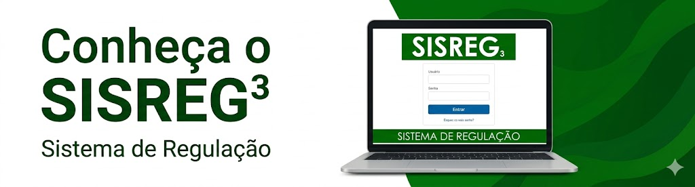

# Manual SISREG

Bem-vindo ao manual online do **Sistema de Regulação – SISREG**.

O SISREG é um sistema web desenvolvido pelo DATASUS/MS, disponibilizado gratuitamente para estados e municípios, destinado à gestão de todo o Complexo Regulador.

---

*Elaboração, distribuição e informações*

**MINISTÉRIO DA SAÚDE**  
Secretaria de Atenção Especializada à Saúde – SAES  
Departamento de Regulação Assistencial e Controle – DRAC

---

## Perfis de Usuário

- **[Administrador](/docs/01_ADMINISTRADOR/)** — Administrador estadual e municipal
- **[Regulador/Autorizador](/docs/02_REGULADOR_AUTORIZADOR/)** — Regulação e autorização
- **[Coordenador de Unidade](/docs/03_COORDENADOR_DE_UNIDADE/)** — Coordenação da unidade
- **[Solicitante](/docs/04_SOLICITANTE/)** — Solicitações ambulatoriais e hospitalares
- **[Executante](/docs/05_EXECUTANTE/)** — Atendimento ambulatorial
- **[Executante Int](/docs/06_EXECUTANTE_INT/)** — Internação hospitalar
- **[Auditor](/docs/07_AUDITOR/)** — Auditoria de AIH
- **[Videofonista](/docs/08_VIDEOFONISTA/)** — Registro sem conectividade

## Suporte

- **[Erros e Soluções](/docs/09_ERROS/)** — Resolução de problemas comuns
- **[LGPD](/docs/10_LGPD/)** — Lei Geral de Proteção de Dados
- **[Outros](/docs/99_OUTROS/)** — Glossário, legislação e referências
